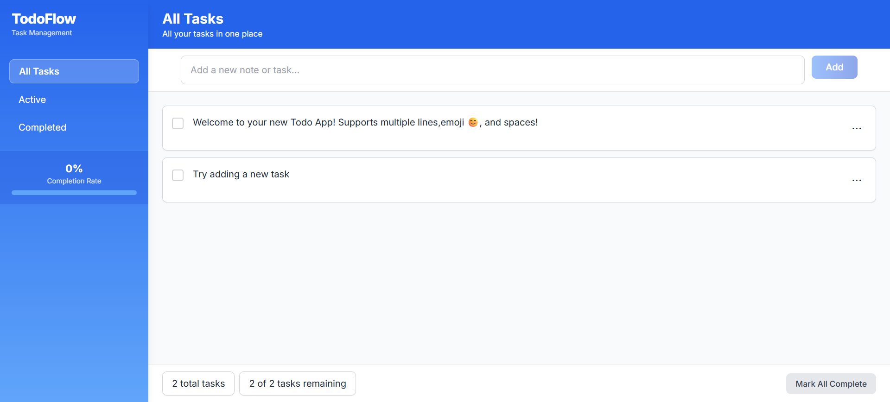
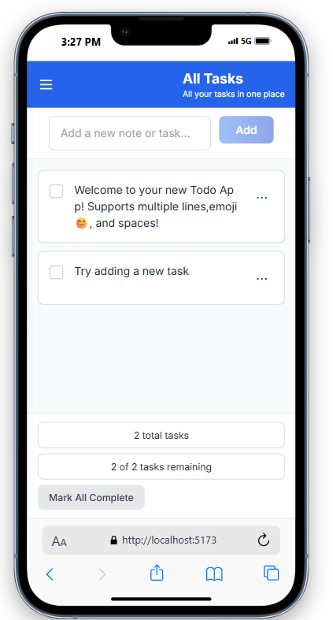
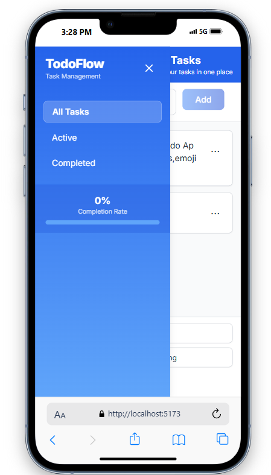

#  Aplikasi Todo List - Tugas 5 (Pertemuan 7)
## Praktikum Pemrograman Berbasis Komponen

Ini adalah **aplikasi Todo List** untuk **Tugas 5, Pertemuan 7** pada mata kuliah **Praktikum Pemrograman Berbasis Komponen**.  
Fokus utama tugas ini adalah **menggunakan [Pinia](https://pinia.vuejs.org/)** sebagai state management modern pada Vue 3.

---

##  Fitur Utama

- Menambah tugas / catatan
- Mengedit dan menghapus tugas
- Tandai tugas sebagai selesai / belum selesai (dengan efek coret)
- Filter tampilan (All, Active, Completed)
- Sidebar dengan progress persen tugas selesai
- Responsive design (mobile & desktop)
- **Menghitung total tugas dan jumlah tugas yang belum selesai**

---

##  Implementasi Pinia

Store `useTodosStore` dibuat menggunakan Composition API:

-  **State**: daftar tugas (`todos`)
- **Actions**:
  - `addTodo` → menambah tugas
  - `deleteTodo` → menghapus tugas
  - `editTodo` → mengedit tugas
  - `toggleTodo` → menandai selesai/belum selesai
  - `clearCompleted`, `markAllComplete`
-  **Getters**:
  - `allTodos` → semua tugas
  - `activeTodos` → tugas yang belum selesai
  - `completedTodos` → tugas yang sudah selesai
  - `remainingCount` → **menghitung jumlah tugas yang belum selesai**
  - `totalCount` → **menghitung total semua tugas**

Semua pengelolaan state dilakukan terpusat dengan Pinia sesuai ketentuan tugas.

---

##  Teknologi Digunakan

- Vue.js 3 + Composition API
- Vite
- Pinia (JavaScript)
- Vue Router
- Tailwind CSS

---

##  Screenshot
### Mobile Mode

